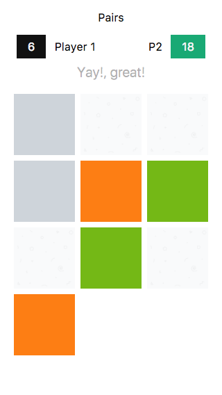

# Pairs

A memory game

[Demo](https://singuerinc-labs.gitlab.io/pairs/)

## Tech

I was using this project as a fun way to learn a bit more about [Vue.js](https://vuejs.org/)

## License

See the [LICENSE](LICENSE.md) file for license rights and limitations (MIT).